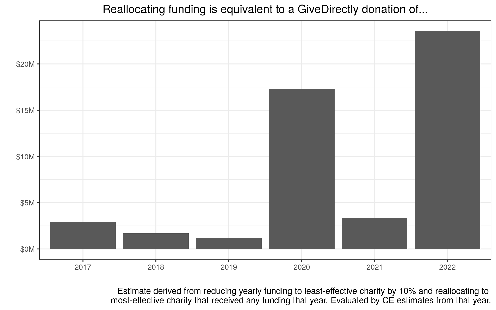
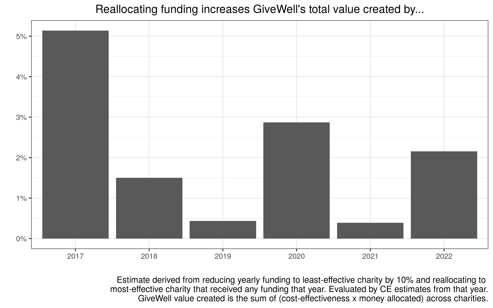
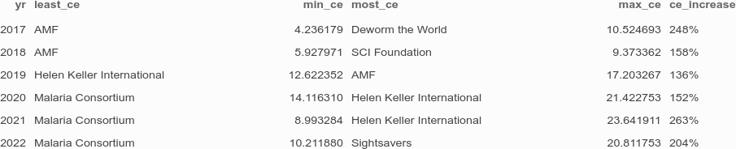
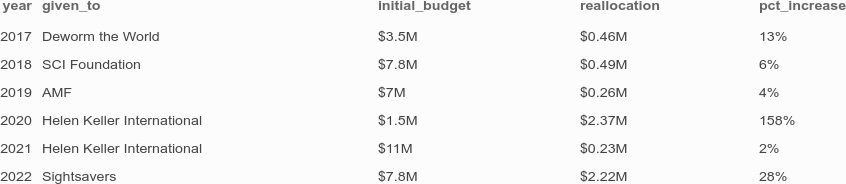
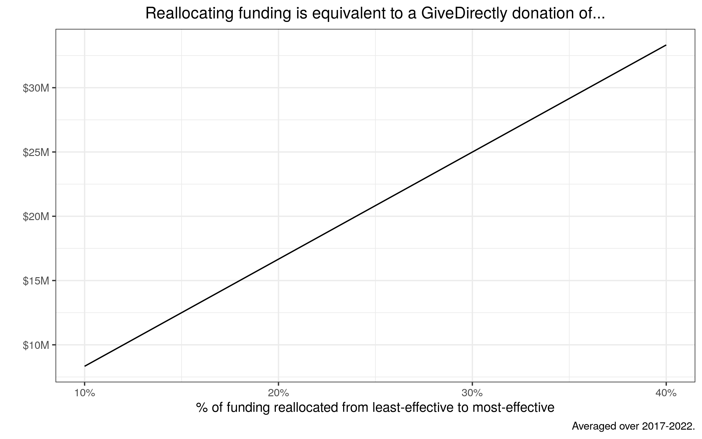

# Millions in cash transfers, without spending a penny

> People who decide how to spend health budgets hold the lives or livelihoods of many other people in their hands. They are literally making life-or-death decisions. Most decisions of this sort take dramatically insufficient account of cost-effectiveness. As a result, thousands or millions of people die who otherwise would have lived. The few are saved at the expense of the many. It is typically done out of ignorance about the significance of the cost-effectiveness landscape rather than out of prejudice, but the effects are equally serious.

&mdash;Toby Ord, *The Moral Imperative Towards Cost-Effectiveness in Global Health*

What if GiveWell could generate an amount of value equivalent to donating $3-$20 million to GiveDirectly, without spending any money at all?

Charities, even within GiveWell's top charities list, vary in their cost-effectiveness. This submission explores a simple counterfactual: how much value GiveWell could create by reallocating a small fraction of their giving from less-effective top charities to more-effective top charities. Specifically, I consider the following *extremely conservative* scenario:

1. I consider only charities that received funding from GiveWell in a given calendar year.
2. I rank these charities by their estimated cost-effectiveness within that year.
3. I take *10\%* of the funding GiveWell provided to the least-effective charity, and reallocate that money to the most-effective charity that GiveWell funded that year.
4. I consider the net units of value created by this reallocation (units from the more effective charity, minus units lost from the less effective charity), using GiveWell's units where 1 unit is equivalent to a dollar to GiveDirectly.

Depending on the year, this reallocation would be equivalent to donating $3-$20 million to GiveDirectly.

I recommend ignoring the 2020 value for reasons described later. If you prefer to think of this effect in terms of the total value created by GiveWell, this would increase the value created by GiveWell by 1-5%. In other words, if you consider the total welfare of GiveWell's allocation to be its total allocation, weighted by the cost-effectiveness of each charity allocation, then this reallocation increases the total welfare from GiveWell allocations by 1-5%.

These graphs contains the sum and substance of my argument. Under extremely conservative assumptions about what reallocations are feasible, GiveWell can do good equivalent to millions of dollars in cash transfers, without spending a single penny. The rest of this post is going to defend these assumptions.

## Are cost-effectiveness estimates reliable enough to make decisions on, beyond a cutoff?

A reasonable objection might be that our cost-effectiveness estimates are probably unreliable beyond orders of magnitude differences, so prioritizing based on smaller differences may not be optimal. Indeed, GiveWell [makes this point](https://www.givewell.org/how-we-work/our-criteria/cost-effectiveness/cost-effectiveness-models):

> We view cost-effectiveness analyses as valuable for helping us identify large differences in the cost-effectiveness of organizations we're considering for a recommendation and to encourage staff to think through relevant issues related to charities' work. However, although we spend significant staff time on our cost-effectiveness analyses, we consider our cost-effectiveness numbers to be extremely rough. We do not make charity recommendations solely on the basis of cost-effectiveness calculations and will rely heavily on other factors, such as an organization's track record, when we are comparing organizations with cost-effectiveness estimates that are not very different.

Nonetheless, I think the cost-effectiveness increases implied by this reallocation more than meets GiveWell's bar for a decision-relevant increase. From the [contest announcement](https://www.givewell.org/research/change-our-mind-contest): (emphasis my own)

> A competitive entry will propose a concrete change to our cost-effectiveness analysis with **meaningful implications** for how we should change the way we allocate funding. Roughly, a critique should imply **at least a 10% change** to our bottom-line cost-effectiveness estimate for a given program.

We don't care about a program's cost-effectiveness estimate for the sake of that program; we care about a program's cost-effectiveness because we want to guide our marginal dollar. And if GiveWell feels comfortable changing their allocation decisions based on a 10% change in bottom-line cost-effectiveness, how about a 150-250\% increase in the cost-effectiveness of their marginal dollar?

Moreover, I think that underlying GiveWell's caution about using cost-effectiveness is a [cluster thinking](https://blog.givewell.org/2014/06/10/sequence-thinking-vs-cluster-thinking/) worldview. GiveWell does not want to let speculative cost-effectiveness estimates override practical knowledge about organizations and what good they can do. I am very sympathetic to this worldview, and I would say I subscribe to it myself. But my comparison is not across the universe of charities, with all the speculation that entails. My comparison is across *charities that GiveWell funded within a given year.* In other words, GiveWell has already shown that they believe in the track record of these organizations and are confident in recommending them. Cluster thinking is invaluable on the *extensive* margin: whether to recommend a charity or not. It is much less helpful on the *intensive* margin, or how much to fund them, especially when I am proposing such a modest change in the funding levels.

In short, these cost-effectiveness changes are substantial, and even if you worry about taking cost-effectiveness numbers literally, this is applying them in a very modest way that even a cluster-thinker should be fine with.

## Can charities absorb this money? 

An obviously important constraint is that GiveWell can't give charities more money than they can absorb. This is why I excluded charities that did not receive any money in a year, since that could indicate they were unable to absorb funding for that year. Nonetheless, you might worry about the intensive margin as well: maybe this reallocation can't be absorbed by charities, even if they received money for that year. Below, I calculated how much this counterfactual increase would be as a percentage of that charity's real allocation from GiveWell.

For all years except 2020 and 2022, the proposed reallocation is a trivial fraction of the money that GiveWell provided that charity anyway. For 2020, the proposed reallocation is outrageous, which is why I recommend ignoring the welfare gains from 2020 in the initial graph. For 2021 and 2022, I can compare these estimates to the charity's stated room for more funding, as reported in [GiveWell's CEA of 2020](https://docs.google.com/spreadsheets/d/16XOOB1oWse1ICbF0OVXUYtwWwpvG3mxAAQ6LYAAndQU/edit#gid=1377543212). In 2021, Helen Keller International would have received an extra $230,000, compared to their projected room for more funding of $2.7 million, meaning they could have absorbed all that money. In 2022, Sightsavers would have received $2.2 million, but they would have only had a need for $1.6 million, so around 70% of that money could have been absorbed.

In short, charities could almost certainly absorb the money from this proposed reallocation.

## Is reallocation bad for reliability?

There are tremendous benefits to charities having reliable funding. Funders should aim to minimize volatility in their funding, because volatility prevents charities from planning and reduces the amount of good they can do. Since cost-effectiveness estimates can change year-to-year, and my analysis uses estimates from the given year (since this is the decision-relevant estimate that GiveWell has access to), doesn't this kind of reallocation create unacceptable volatility in funding for charities?

This is a valid objection to counterfactuals such as "eliminate one less-effective charity from the Top Charities Fund". But this exercise is not about extreme reallocations; it's about a 10\% reallocation. I can't say that I have as much experience working with charities as the folks at GiveWell, but I find it hard to believe that would inhibit a charity's planning capacity. This is especially true because GiveWell doesn't even [fund its top charities every year.](https://www.givewell.org/top-charities-fund)

## Conclusion

Cost-effectiveness prioritization is hard, but I started this post with Toby Ord's quote to emphasize that the stakes are very high. This is true even when you're on the tails of the cost-effectiveness distribution - when you're far beyond the easy case of a median charity or a 90th percentile charity, when you're choosing between 99.9th percentile charities and 99.99th percentile charities. The combination of GiveWell's large allocations and the substantial spread in cost-effectiveness between their funded charities means that the gains from reallocation are enormous. I think all of us would regard $3 million spent by GiveDirectly as a tremendous amount of good, and we should take these gains when they come quite literally for free.

As a final note, I've picked 10% as a sensible, conservative fraction, so that even the most skeptical cluster thinker can see the value of this reallocation. I'm sure that someone at GiveWell with more knowledge can pick a more appropriate funding reallocation, so I've calculated the returns to many different reallocations:

In short, GiveWell should take its cost-effectiveness analyses a little more seriously than they currently do---doing so could create millions in value at no extra cost.

*All details of this analysis, including how I compiled cost-effectiveness estimates and the Top Charities Fund allocations, are available in [this GitHub repo.](https://github.com/karthiktadepalli1/givewell-reallocation)*
